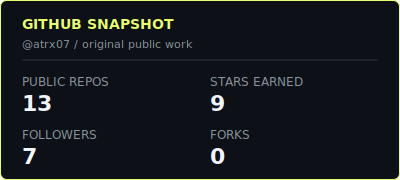
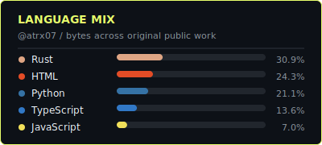
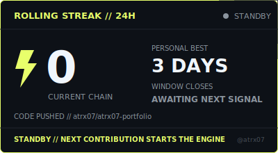

<div align="center">

```
 █████╗ ████████╗██████╗ ██╗  ██╗ ██████╗ ███████╗
██╔══██╗╚══██╔══╝██╔══██╗╚██╗██╔╝██╔═████╗╚════██║
███████║   ██║   ██████╔╝ ╚███╔╝ ██║██╔██║    ██╔╝
██╔══██║   ██║   ██╔══██╗ ██╔██╗ ████╔╝██║   ██╔╝
██║  ██║   ██║   ██║  ██║██╔╝╚██╗╚██████╔╝   ██║
╚═╝  ╚═╝   ╚═╝   ╚═╝  ╚═╝╚═╝  ╚═╝ ╚═════╝    ╚═╝
```

### `{ building useful things at the edge of practical and unusual }`

[](https://git.io/typing-svg)

<p>
Engineering student building local AI software, real-time applications, and bots with memory.<br/>
I like turning ambitious ideas into systems that can survive contact with real users and real hardware.
</p>

[](https://github.com/atrx07)
[](mailto:arppithandrewsee@gmail.com)

</div>

---

## `CURRENTLY BUILDING`

<table>
<tr>
<td>

### [NeuraLoc-Core](https://github.com/atrx07/NueraLoc-Core)

**A privacy-first Windows desktop application for discovering, managing, and running local AI models.** NeuraLoc-Core combines a React and TypeScript interface with Tauri 2, Rust orchestration, SQLite metadata, and verified native inference engines.


- **Current checkpoint:** Local GGUF indexing, a verified `llama.cpp` CPU runtime, model lifecycle controls, streaming chat, exact token-aware context, versioned prompts, durable history, branching, retry, and Markdown export.
- **Coming next:** A model discovery and download catalog, hardware-aware multi-backend recommendations, layered prompt composition, stronger draft recovery, and release-ready Windows packaging.
- **North star:** A dependable local-AI control center that keeps models and conversations on the user's machine while making hardware limits, model provenance, and runtime behavior easy to understand.

</td>
</tr>
</table>

---

## `SELECTED WORK`

<table>
<tr>
<td valign="top">

### [void.chat](https://github.com/atrx07/void-chat)

A real-time global chatroom with Firebase authentication, WebSocket delivery through Cloudflare Durable Objects, and message persistence in D1.

`Cloudflare Workers` // `Durable Objects` // `D1` // `Firebase`

</td>
</tr>
<tr>
<td valign="top">

### [Aveline Bot](https://github.com/atrx07/aveline-bot)

A WhatsApp AI chatbot with persistent per-user memory, mood-aware replies, group support, and resilient Groq key and model fallback.

`Baileys` // `Groq` // `Upstash Redis` // `Railway`

</td>
</tr>
<tr>
<td valign="top">

### [Cecilia Bot](https://github.com/atrx07/cecilia-bot) <sup>`private`</sup>

A Discord character bot with staged relationship progression, per-user conversations, persistent emotional state, DM onboarding, and slash-command controls.

`discord.js` // `Groq` // `Upstash Redis`

</td>
</tr>
<tr>
<td valign="top">

### [StyleForge Lite](https://github.com/atrx07/styforge)

A mobile-first Yamaha arranger style sketchpad with a browser sequencer, WebAudio preview, project save/load, MIDI export, and experimental `.STY` generation.

`JavaScript` // `WebAudio` // `MIDI` // `Yamaha SFF1`

</td>
</tr>
<tr>
<td valign="top">

### [AtrxInstaDown](https://github.com/atrx07/atrxinstadown)

A lightweight, installable mobile interface for an Instagram downloader, designed around a fast no-login flow for posts, Reels, and videos.

`HTML` // `CSS` // `JavaScript` // `PWA`

</td>
</tr>
<tr>
<td valign="top">

### More experiments

The rest of my repositories cover load testing, Instagram tooling, Telegram automation, security interfaces, and small Python utilities.

[Browse all repositories ->](https://github.com/atrx07?tab=repositories)

</td>
</tr>
</table>

---

## `TOOLBOX`

<div align="center">


</div>

---

## `PROFILE`

```yaml
name: Arppith Andrews
handle: atrx07
role: Engineering Student / Builder
interests:
  - Local AI and native desktop systems
  - Real-time web applications
  - Bots, automation, and persistent memory
  - Tools that make complicated workflows feel simple
working_style: Build it, test it on the real target, then keep refining.
```

---

## `GITHUB`

<div align="center">




<br/>


</div>

---

<div align="center">

```
[ built from scratch ]
[ shipped from chaos ]
```


</div>
