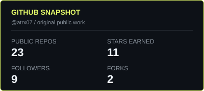
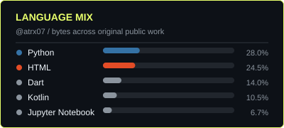
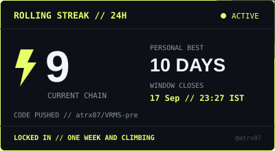

<div align="center">

```
 █████╗ ████████╗██████╗ ██╗  ██╗ ██████╗ ███████╗
██╔══██╗╚══██╔══╝██╔══██╗╚██╗██╔╝██╔═████╗╚════██║
███████║   ██║   ██████╔╝ ╚███╔╝ ██║██╔██║    ██╔╝
██╔══██║   ██║   ██╔══██╗ ██╔██╗ ████╔╝██║   ██╔╝ 
██║  ██║   ██║   ██║  ██║██╔╝╚██╗╚██████╔╝   ██║  
╚═╝  ╚═╝   ╚═╝   ╚═╝  ╚═╝╚═╝  ╚═╝ ╚═════╝    ╚═╝  
```

### `{ building useful things at the edge of practical and unusual }`

[](https://git.io/typing-svg)

<p>
Engineering student building local AI software, real-time applications, and bots with memory.<br/>
I like turning ambitious ideas into systems that can survive contact with real users and real hardware.
</p>

[](https://github.com/atrx07)
[](mailto:arppithandrewsee@gmail.com)

</div>

---

## `CURRENTLY BUILDING`

<table>
<tr>
<td>

### [N### [Traelyx](https://github.com/atrx07/Traelyx)

**An open-source, local-first Android platform for driving telemetry and driver intelligence.** Traelyx is being built to record and analyze trips, explain driver behavior, and deliver history and synchronized replay without requiring an account or mandatory cloud access. Its foundation combines Flutter and Dart with Riverpod, `go_router`, Drift, and a versioned Kotlin recorder bridge.


- **Current milestone — M1 Application Foundation:** M0 and M1.1 are complete. M1.2 navigation is locally validated and awaiting remote CI; the app shell, semantic theme, local settings bootstrap, and navigation skeleton are in place, while trip recording remains intentionally unavailable.
- **Coming next — M2 Native Recording Engine:** Finish the M1 persistence, migration, and diagnostics foundation, then add a recoverable Android foreground recorder with GNSS/IMU acquisition, crash-safe buffering, and physical-drive validation.
- **Release target — M8 / v0.1.0:** Deliver a hardened, installable local-first driving companion with explainable telemetry, deterministic driver intelligence, trip history, and synchronized replay. [Follow the roadmap →](https://github.com/atrx07/Traelyx/blob/main/docs/exec-plans/ROADMAP.md)

</td>
</tr>
</table>

---

## `SELECTED WORK`

<table>
<tr>
<td valign="top">

### [void.chat](https://github.com/atrx07/void-chat)

A real-time global chatroom with Firebase authentication, WebSocket delivery through Cloudflare Durable Objects, and message persistence in D1.

`Cloudflare Workers` // `Durable Objects` // `D1` // `Firebase`

</td>
</tr>
<tr>
<td valign="top">

### [Aveline Bot](https://github.com/atrx07/aveline-bot)

A WhatsApp AI chatbot with persistent per-user memory, mood-aware replies, group support, and resilient Groq key and model fallback.

`Baileys` // `Groq` // `Upstash Redis` // `Railway`

</td>
</tr>
<tr>
<td valign="top">

### [Cecilia Bot](https://github.com/atrx07/cecilia-bot) <sup>`private`</sup>

A Discord character bot with staged relationship progression, per-user conversations, persistent emotional state, DM onboarding, and slash-command controls.

`discord.js` // `Groq` // `Upstash Redis`

</td>
</tr>
<tr>
<td valign="top">

### [StyleForge Lite](https://github.com/atrx07/styforge)

A mobile-first Yamaha arranger style sketchpad with a browser sequencer, WebAudio preview, project save/load, MIDI export, and experimental `.STY` generation.

`JavaScript` // `WebAudio` // `MIDI` // `Yamaha SFF1`

</td>
</tr>
<tr>
<td valign="top">

### [AtrxInstaDown](https://github.com/atrx07/atrxinstadown)

A lightweight, installable mobile interface for an Instagram downloader, designed around a fast no-login flow for posts, Reels, and videos.

`HTML` // `CSS` // `JavaScript` // `PWA`

</td>
</tr>
<tr>
<td valign="top">

### More experiments

The rest of my repositories cover load testing, Instagram tooling, Telegram automation, security interfaces, and small Python utilities.

[Browse all repositories ->](https://github.com/atrx07?tab=repositories)

</td>
</tr>
</table>

---

## `TOOLBOX`

<div align="center">


</div>

---

## `PROFILE`

```yaml
name: Arppith Andrews
handle: atrx07
role: Engineering Student
specialization: Computer Science / AI / Automation
interests:
  - Local AI and native desktop systems
  - Real-time web applications
  - Bots, automation, and persistent memory
  - Tools that make complicated workflows feel simple
working_style: Build it, test it on the real target, then keep refining.
```

---

## `GITHUB`

<div align="center">




<br/>


</div>

---

<div align="center">

```
[ built from scratch ]
[ shipped from chaos ]
```


</div>
